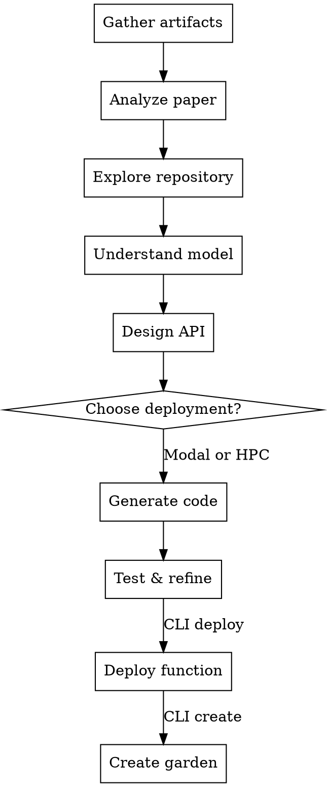

# Gardener: End-to-End Garden-AI Publication

## Overview

Guides researchers from published paper to deployed Garden-AI function. Core principle: **Understand the science first, design thoughtful APIs, then generate correct Garden-AI code.**

This is a complete workflow from research artifacts (paper PDF + code repo) to publishable Garden-AI functions.

## What is Garden-AI?

Garden-AI is a FAIR (Findable, Accessible, Interoperable, Reusable) AI/ML model publishing platform that enables:

- **Citable Scientific Functions**: Each published function/model gets a DOI for academic citation
- **Remote Execution**: Run models on cloud (Modal) or HPC systems without local setup
- **Simple Python SDK**: Domain scientists use models via clean Python APIs
- **Diverse Compute**: From serverless GPUs to multi-node HPC clusters

**Two Deployment Platforms:**
1. **Modal** - Serverless cloud (fast inference, auto-scaling, pay-per-use)
2. **groundhog_hpc** - HPC clusters via Globus Compute (long jobs, multi-GPU, specialized hardware)

## When to Use

Use when:
- Researcher wants to publish ML model on Garden-AI
- User has paper + code but doesn't know Modal/groundhog
- Converting research code to Garden-AI functions
- User says "publish my model on Garden" or "make this Garden-AI ready"
- Need to design API for scientific model deployment
- Helping with Matbench Discovery or other Garden benchmarks

Don't use for:
- Standard Python scripts (not for Garden-AI)
- Non-scientific computing workloads
- Code already in Garden-AI format
- General CLI tool development

## Key Implementation Facts

**CRITICAL: Calling Conventions Differ by Platform**

| Platform | Type | How Users Call It | Example |
|----------|------|-------------------|---------|
| Modal | function | Direct call (NO `.remote()`) | `garden.func(args)` |
| Modal | class | Direct call (NO `.remote()`) | `garden.Class.method(args)` |
| groundhog | function | `.remote()` (blocking) | `garden.func.remote(args, endpoint="anvil")` |
| groundhog | function | `.submit()` (async) | `future = garden.func.submit(args, endpoint="anvil")` |
| groundhog | class | `.remote()` on method | `garden.Class.method.remote(args, endpoint="anvil")` |

**Other Key Differences:**

| Aspect | Modal | groundhog_hpc |
|--------|-------|---------------|
| Imports | INSIDE functions only | Module level OK |
| Metadata | `modal.App()` + `image` | PEP 723 `# /// script` |
| Testing | `@app.local_entrypoint()` | `@hog.harness()` |
| Endpoint | Auto-handled by backend | Must specify `endpoint="name"` |
| Classes | `@app.cls()` + `@modal.method()` | Class + `@hog.method()` |

## Workflow Overview



**Quick Reference:**

| Phase | Key Actions | Supporting File |
|-------|-------------|-----------------|
| 1-5: Understand | Gather, analyze, explore, synthesize, design API | workflow-phases.md |
| 6: Choose | Modal vs HPC decision | workflow-phases.md |
| 7: Generate | Write Modal app or groundhog script following patterns | modal-pattern.md / hpc-pattern.md |
| 8: Test & Refine | **ACTIVELY RUN** code, debug errors, fix, repeat until working | workflow-phases.md |
| 9: Deploy | Deploy function via CLI: `garden-ai function modal deploy` or `hpc deploy` | cli-reference.md |
| 10: Publish | Create garden via CLI: `garden-ai garden create` | cli-reference.md |

**Phase 8 is MANDATORY and ACTIVE:**
- Must execute: `uv run modal run` or `uv run hog run`
- If it works → Ready for CLI deployment (Phase 9)
- If it fails → Debug and fix until it works
- Cannot skip or assume it works

**Phases 9-10: CLI-Driven Publication:**
- Phase 9: Deploy function with `garden-ai function modal deploy` or `garden-ai function hpc deploy`
- Phase 10: Create garden with `garden-ai garden create` including the deployed function IDs

## How to Use This Skill

1. **Start here** - Read this file to understand the workflow
2. **Follow phases 1-6** - Read workflow-phases.md for detailed guidance
3. **Choose deployment**:
   - For Modal: Read modal-pattern.md
   - For HPC: Read hpc-pattern.md
4. **Test code (Phase 8)** - Return to workflow-phases.md
5. **Deploy & Publish (Phases 9-10)** - Use CLI commands from cli-reference.md

**IMPORTANT:** You don't need all files in context at once. Load them as needed:
- Always load: This file (SKILL.md)
- Phases 1-6: Load workflow-phases.md
- Modal generation: Load modal-pattern.md
- HPC generation: Load hpc-pattern.md
- CLI deployment/publishing: Load cli-reference.md

## Red Flags - STOP and Follow Workflow

**Checkpoint violations (check workflow-phases.md):**
- "I'll just move to the next phase"
- "User understands, no need to confirm"
- "This is obviously correct"
- "Asking will slow us down"
- "I'll check with user if there are problems"
- "Checkpoints are optional for simple models"

**Workflow shortcuts (check workflow-phases.md):**
- "I can skip reading the paper"
- "I know what this model does"
- "Standard ML API will work"
- "User can figure out the API"
- "Just make it work quickly"

**Code violations (check pattern files):**
- "Imports at top are cleaner"
- "User will add metadata later"
- "This works without decorators"
- "Time is tight, skip the boilerplate"
- "Ready to publish" (before verification)

**Testing violations (check Phase 8 in workflow-phases.md):**
- "I wrote tests but won't run them"
- "It should work without testing"
- "User can test it themselves"
- "Small errors are probably fine"
- "Testing takes too long"
- Moving to Phase 9 without running code

**All of these mean: Stop. Load the appropriate supporting file and follow it exactly. All checkpoints are MANDATORY.**

## Verification Checklist

Before claiming done, verify against checklists in:
- workflow-phases.md (phases completed)
- modal-pattern.md or hpc-pattern.md (code patterns)

## Real-World Impact

**Following this workflow:**
- Researchers publish scientifically accurate models
- Domain scientists can easily use the functions
- APIs match field conventions
- Code runs reliably on Garden-AI platform
- Models become citable and reusable

**Skipping steps:**
- APIs that don't match domain conventions
- Functions that misinterpret the model
- Missing dependencies or preprocessing
- Scientific errors in outputs
- Code fails on remote execution

## Quick Decision Guide

**Choose Modal when:**
- Fast inference (<5 min per batch)
- Single GPU or CPU-only
- Standard Python packages
- Auto-scaling needed
- Example: Image classification, molecule property prediction

**Choose groundhog_hpc when:**
- Long computations (hours)
- Multi-GPU or multi-node
- HPC-specific libraries (MPI, SLURM tools)
- User has HPC allocations
- Example: DFT calculations, MD simulations, structure optimization

## Supporting Files

- **workflow-phases.md** - Detailed publication workflow phases 1-8
- **modal-pattern.md** - Complete Modal app pattern and examples
- **hpc-pattern.md** - Complete HPC/groundhog pattern and examples
- **cli-reference.md** - Garden-AI CLI commands for deployment and publication

## Common Pitfalls

❌ **Mixing up Modal and groundhog patterns:**
- Modal: Imports INSIDE functions, NO `.remote()` in user code
- groundhog: Imports at module level OK, MUST use `.remote()` with `endpoint`

❌ **Wrong calling convention:**
```python
# Modal (via Garden SDK):
result = garden.my_modal_function(args)  # ✅ Correct
result = garden.my_modal_function.remote(args)  # ❌ Wrong

# groundhog (via Garden SDK):
result = garden.my_hpc_function.remote(args, endpoint="anvil")  # ✅ Correct
result = garden.my_hpc_function(args)  # ❌ Wrong - will error
```

❌ **Using wrong decorators:**
- Modal: `@app.function()` and `@app.cls()` / `@modal.method()`
- groundhog: `@hog.function()` and `@hog.method()`

❌ **Not testing in Phase 8:**
- Phase 8 is MANDATORY - you MUST run the code
- Execute: `uv run modal run` or `uv run hog run`
- If errors occur: Fix them and re-run (iterate until success)
- Success criterion: Command completes without errors + output looks correct
- Don't move to Phase 9 until code actually runs successfully
